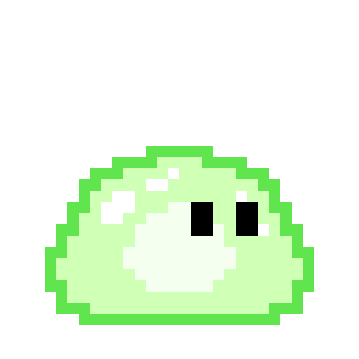
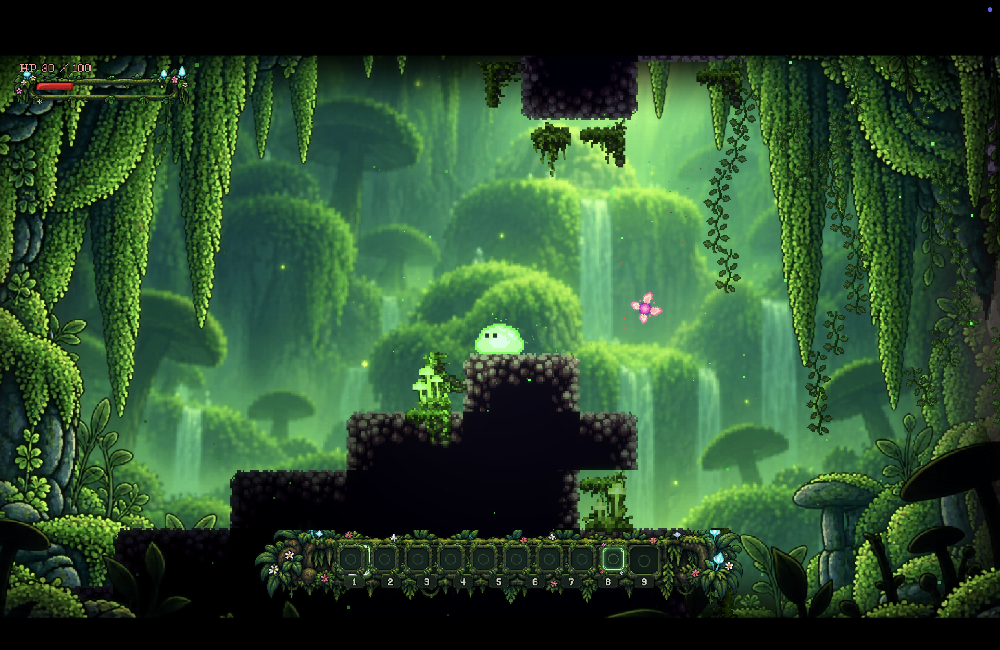
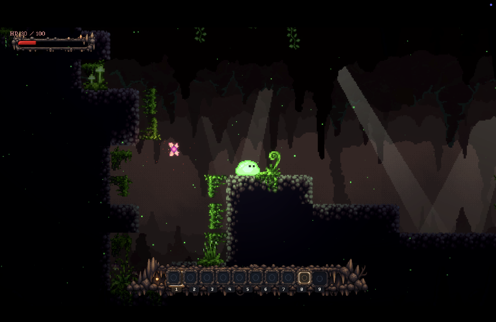

<div align="center">



# Joey’s Slimeventure

**A pixel-art cave adventure about a very small slime in a very large underground world.**

**Explore. Adapt. Go deeper.**

<br>



<br><br>

<a href="https://store.steampowered.com/app/4536840/Joeys_Slimeventure/">
  
</a>
<a href="https://joeyslime.com">
  
</a>
<a href="https://discord.gg/warNZJhXFc">
  
</a>
<a href="https://buymeacoffee.com/pondsec">
  
</a>

<br><br>

<a href="https://github.com/PondSec/JoeysSlimeventure/releases">
  
</a>
<a href="https://github.com/PondSec/JoeysSlimeventure/stargazers">
  
</a>
<a href="https://github.com/PondSec/JoeysSlimeventure/issues">
  
</a>
<a href="https://github.com/PondSec/JoeysSlimeventure/blob/main/LICENSE">
  
</a>

</div>

---

## About

Joey’s Slimeventure is an open-source pixel-art platformer built with Godot 4.7.

You play as Joey, a small slime descending into a strange underground world of procedurally generated caves, hidden paths, unusual creatures, environmental hazards and distinct subterranean biomes.

The game combines handcrafted pixel art with procedural generation to create environments that are unpredictable without feeling arbitrary. Caves branch, descend, reconnect and open into chambers, landmarks and hidden spaces instead of following a simple left-to-right path.

Each region develops its own visual identity, atmosphere, vegetation, creatures and hazards.

Joey’s Slimeventure is currently in active development.

---

## The Underground

The underground is not a sequence of straight levels.

Caves are generated around branching routes, vertical traversal, chambers, alternate paths and landmarks. Exploration is intended to feel like finding your way through an actual cave rather than simply moving toward the right side of the screen.

The world changes as Joey travels deeper.

### Lush Cave


The upper reaches of the underground are dense with vegetation, hanging growth, luminous life and an almost overwhelming amount of green.

Plants cover the rock, tiny creatures move between the vegetation and traces of light still reach far into the cave.

The Lush Cave introduces Joey to a world that feels alive. Vegetation grows across the cave walls, ambient creatures inhabit the environment and the boundaries between rock and plant life begin to disappear.

### Stone Cave



Deeper underground, the environment becomes darker and harsher.

Vegetation becomes sparse, exposed stone dominates the cave and the warm, living atmosphere of the Lush Cave begins to disappear.

The Stone Cave represents a clear environmental transition. Open vegetation gives way to darker rock formations, narrower passages and a more hostile underground atmosphere.

Different cave regions are more than visual variations. Their environment, inhabitants, landmarks and atmosphere form part of the progression into the underground.

---

## A Living Cave

Not everything Joey encounters wants to fight him.

The caves contain ambient wildlife alongside hostile creatures. Some inhabitants react to Joey, some flee from him, and others simply exist as part of their biome.

### Irrlichtkäfer

<div align="center">


*A tiny inhabitant of the Lush Cave.*

</div>

The Irrlichtkäfer is a small, peaceful creature found among the vegetation of the Lush biome.

It drifts through the cave, occasionally settling on plants or nearby surfaces. When disturbed, it prefers to flee rather than fight.

Creatures like the Irrlichtkäfer exist to make the caves feel inhabited rather than turning every moving thing into an enemy.

---

## Encounters

The deeper Joey travels, the less welcoming the underground becomes.

Early encounters introduce individual threats gradually before later areas begin combining different enemies, environmental hazards and more dangerous creatures.

### Kristallrücken

<div align="center">


*The first mini-boss of Joey’s descent.*

</div>

Kristallrücken is the first mini-boss encountered during the journey underground.

It marks an early shift from navigating the cave and its smaller inhabitants toward larger encounters built around unique creatures and distinct attack patterns.

More encounters and cave inhabitants will be introduced as development continues.

---

## Features

### Procedural Cave Generation

Levels are constructed as interconnected cave systems rather than traditional linear platforming stages.

Generation focuses on:

- branching routes and alternate paths
- vertical exploration
- variable-width tunnels
- chambers and pockets
- environmental landmarks
- biome-specific decoration
- traversable, validated layouts

Procedural generation determines how the world is assembled while handcrafted assets define its visual identity.

The goal is not to create random platforms. Generated levels are intended to resemble connected cave systems with readable traversal while retaining enough variation to make exploration unpredictable.

### Handcrafted Pixel Art

Characters, creatures, environments, animations, effects and interface elements are designed around a cohesive pixel-art visual language.

Each biome receives its own environmental assets, lighting, vegetation and interface treatment while remaining part of the same world.

### Distinct Cave Biomes

Different regions of the underground introduce their own:

- visual identity
- vegetation
- lighting
- environmental effects
- creatures
- hazards
- landmarks
- atmosphere

The world becomes less familiar as Joey travels deeper.

### Platforming & Combat

Movement, exploration and combat are closely connected.

Players navigate irregular cave terrain while dealing with creatures, hazards and increasingly complex environments.

### Dynamic Environments

Animated flora, particles, environmental lighting and layered parallax backgrounds add movement and depth while preserving the game’s pixel-art presentation.

### Exploration & Discovery

The obvious route is not always the only route.

Side passages, chambers, alternate routes and environmental landmarks encourage exploration beyond the direct path forward.

---

## Joey

<div align="center">


**Small slime. Big cave.**

</div>

Joey is the protagonist of Joey’s Slimeventure.

His journey begins in the upper caves, but the underground extends much further than it first appears.

---

## Controls

| Action | Input |
|---|---|
| Move | W A S D |
| Jump | Space |
| Attack | Left Mouse Button |
| Glow | F |
| Inventory | E |
| Pause | Esc |

Controls and gameplay systems may change during development.

---

## Development Status

Joey’s Slimeventure is currently in active development.

This repository contains the actively developed source code of the game.

Expect systems to evolve, content to change and unfinished areas to exist while development continues.

The project is developed publicly so that its progress, technical evolution and development history remain accessible.

### Branches

- `main` — current public and stable development state
- `dev` — active development and integration

New development work is integrated and tested on `dev` before being promoted to `main`.

---

## Play Joey’s Slimeventure

### Steam

Joey’s Slimeventure has an official Steam page where you can follow the game and keep up with future releases.

<div align="center">

<a href="https://store.steampowered.com/app/4536840/Joeys_Slimeventure/">
  
</a>

</div>

### GitHub Releases

Development builds are also published directly through GitHub Releases when a public build is available.

#### Windows

[Download the latest development release →](https://github.com/PondSec/JoeysSlimeventure/releases)

Windows builds can be launched directly and do not require the Godot editor.

Development builds may contain unfinished content, experimental systems and known issues.

---

## Build from Source

Joey’s Slimeventure currently targets **Godot Engine 4.7**.

### Requirements

- Godot Engine 4.7
- Git
- Git LFS

### Clone

```bash
git lfs install
git clone https://github.com/PondSec/JoeysSlimeventure.git
cd JoeysSlimeventure
```

Open:

```text
project.godot
```

with Godot 4.7.

Press `F5` or select **Run Project** inside Godot to start the game.

### Latest Development State

To switch to the active development branch:

```bash
git checkout dev
git pull origin dev
```

The `dev` branch may contain changes that have not yet been promoted to `main`.

---

## Contributing

Contributions, testing, bug reports, ideas and technical feedback are welcome.

Joey’s Slimeventure is both a game and an evolving open-source project. Contributions can include:

- gameplay systems
- procedural generation
- level and encounter design
- Godot development
- performance and optimization
- pixel art and animation
- sound and music
- testing and bug fixes
- documentation

For substantial changes, please open an issue before beginning implementation so the idea and its integration into the project can be discussed first.

### Pull Requests

When submitting a pull request:

1. Keep the change focused on a clear purpose.
2. Explain what changed and why.
3. Test the affected gameplay and systems.
4. Include screenshots or recordings for visual changes where appropriate.
5. Mention relevant issues where applicable.

---

## Bugs & Suggestions

Found a bug, a broken cave seed or something Joey definitely should not be able to do?

[Open an issue →](https://github.com/PondSec/JoeysSlimeventure/issues)

A useful bug report should include:

- a clear description of the problem
- steps to reproduce it
- game version or commit
- operating system
- screenshots or recordings where useful
- the generated seed when procedural generation is involved

Feature ideas and technical suggestions are welcome as well.

---

## 💚 Support Development

Joey’s Slimeventure is developed independently and is currently in active development.

If you enjoy the project and would like to support its development, you can help fund the continued creation of new environments, creatures, gameplay systems, artwork and other parts of Joey’s journey underground.

**Supporting the project is completely optional.** Following Joey’s Slimeventure, wishlisting the game on Steam, reporting bugs, contributing code or simply sharing the project already helps enormously.

<div align="center">

<a href="https://buymeacoffee.com/pondsec">
  
</a>

<br><br>

**Every bit of support helps Joey venture a little deeper. 💚**

</div>

---

## Community

Development discussion, feedback and community activity also take place on Discord.

<div align="center">

<a href="https://discord.gg/warNZJhXFc">
  
</a>

</div>

Development can also be followed directly through commits, issues and releases in this repository.

---

## Open Development

Joey’s Slimeventure is developed publicly.

The repository provides access to the game’s source code and development history, allowing players and developers to follow how its procedural generation, gameplay systems, environments and creatures evolve over time.

Contributions and experimentation are welcome under the terms of the project’s license.

---

## Technology

<div align="center">

<a href="https://godotengine.org/">
  
</a>


<br><br>

**Godot 4.7 · GDScript · Pixel Art · Procedural Generation**

</div>

---

## License

Joey’s Slimeventure is licensed under the MIT License.

See [LICENSE](LICENSE) for the complete license text.

---

<div align="center">


### Joey’s Slimeventure

**Explore. Adapt. Go deeper.**

<br>

<a href="https://store.steampowered.com/app/4536840/Joeys_Slimeventure/">
  
</a>
<a href="https://joeyslime.com">
  
</a>
<a href="https://discord.gg/warNZJhXFc">
  
</a>
<a href="https://buymeacoffee.com/pondsec">
  
</a>
<a href="https://github.com/PondSec/JoeysSlimeventure">
  
</a>

<br><br>

**Open-source and built with Godot.**

💚 **Every bit of support helps Joey venture a little deeper.**

</div>
